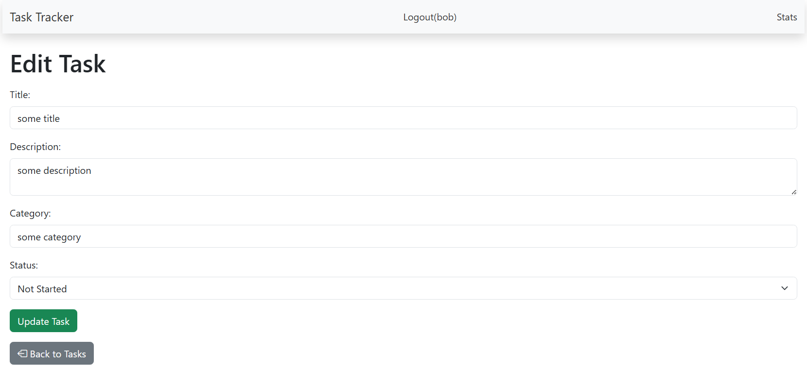
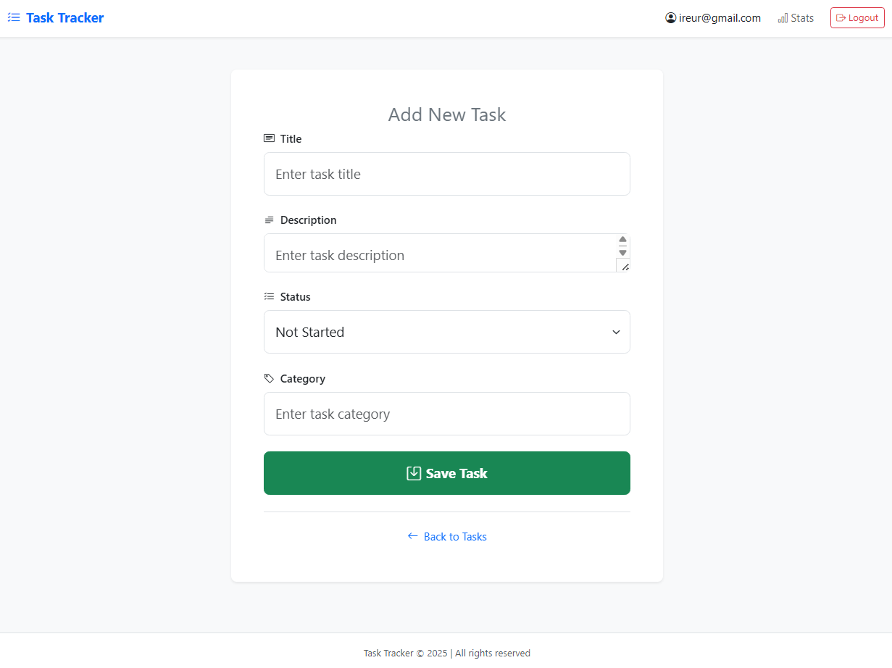
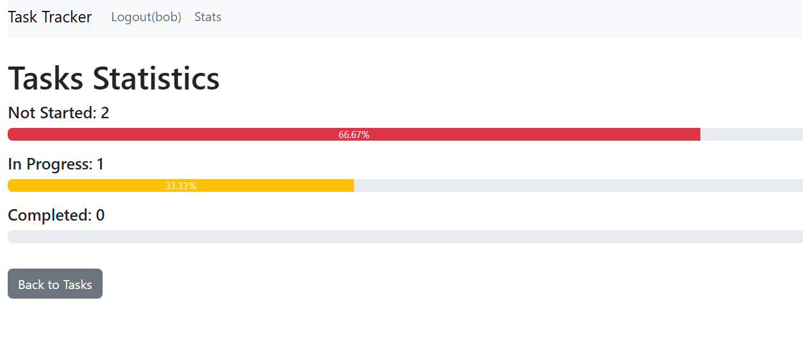

# Task Tracker

Task Tracker — веб-приложение для управления задачами, построенное с использованием Flask, SQLite, Flask-Login и Bootstrap. Поддерживает CRUD-операции, аутентификацию пользователей, фильтрацию задач, сортировку и визуализированную статистику.

## Функционал
- Регистрация и логин пользователей.
- Добавление, редактирование и удаление задач.
- Фильтрация задач по статусу и категории.
- Сортировка задач по дате создания.
- Статистика задач с прогресс-барами.

## Технологии
- Flask
- Flask-SQLAlchemy
- Flask-Login
- Flask-Bcrypt
- Bootstrap
- PythonAnywhere (деплой)

## Live Demo
[https://protocol777.pythonanywhere.com](https://protocol777.pythonanywhere.com)

## Скриншоты

