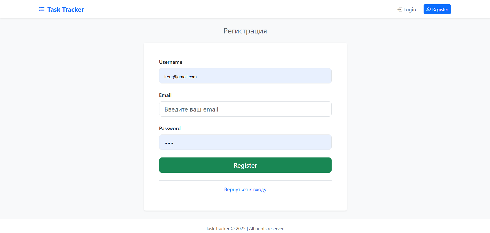
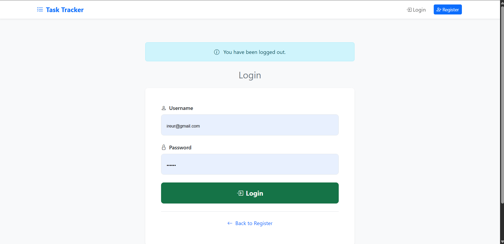

# Task Tracker

Task Tracker — веб-приложение для управления задачами, построенное с использованием Flask, SQLite, Flask-Login и Bootstrap. Поддерживает CRUD-операции, аутентификацию пользователей, фильтрацию задач, сортировку и визуализированную статистику.

## Функционал
- Регистрация и логин пользователей.
- Аутентификация с использованием Flask-Login.
- Хранение задач в базе данных SQLite с помощью Flask-SQLAlchemy.
- Использование Flask-WTF для форм и валидации.
- Аутентификация паролей с помощью Flask-Bcrypt.
- Адаптивный интерфейс с использованием Bootstrap.
- Поддержка нескольких пользователей с разными задачами.
- Главная страница со списком задач.
- Страница добавления новых задач.
- Страница редактирования задач.
- Страница статистики задач с прогресс-барами.
- Поддержка фильтрации и сортировки задач.
- Возможность удаления задач.
- Адаптивный дизайн для мобильных устройств.
- Поддержка нескольких категорий задач.
- Возможность просмотра задач по статусу (активные, завершенные).
- Возможность сортировки задач по дате создания.

## Технологии
- Flask
- Flask-SQLAlchemy
- Flask-Login
- Flask-WTF
- Flask-Bcrypt
- Bootstrap
- PythonAnywhere (деплой)

## Live Demo
[https://protocol777.pythonanywhere.com](https://protocol777.pythonanywhere.com)

## Скриншоты

