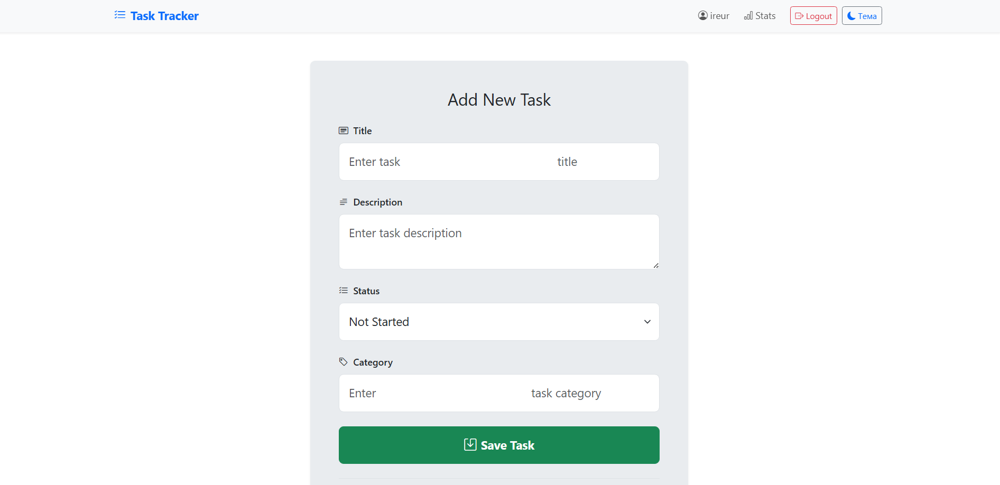

# Task Tracker

Task Tracker — веб-приложение для управления задачами, построенное с использованием Flask, SQLite, Flask-Login и Bootstrap. Поддерживает CRUD-операции, аутентификацию пользователей, фильтрацию задач, сортировку и визуализированную статистику.

## Функционал
- Регистрация и логин пользователей.
- Аутентификация с использованием Flask-Login.
- Хранение задач в базе данных SQLite с помощью Flask-SQLAlchemy.
- Использование Flask-WTF для форм и валидации.
- Аутентификация паролей с помощью Flask-Bcrypt.
- Адаптивный интерфейс с использованием Bootstrap.
- Поддержка нескольких пользователей с разными задачами.
- Главная страница со списком задач.
- Страница добавления новых задач.
- Страница редактирования задач.
- Страница статистики задач с прогресс-барами.
- Поддержка фильтрации и сортировки задач.
- Возможность удаления задач.
- Адаптивный дизайн для мобильных устройств.
- Поддержка нескольких категорий задач.
- Возможность просмотра задач по статусу (активные, завершенные).
- Возможность сортировки задач по дате создания.
- Возможность смены темы интерфейса (светлая/темная).
- Добавлена централизованная обработка ошибок (404 и 500) с пользовательскими шаблонами страниц.
- Экспорт списка задач в формате CSV.
- Улучшенный пользовательский интерфейс (UI/UX):
    * **Адаптивное отображение задач** в виде колонок на больших экранах для лучшего использования пространства.
    * **Оптимизированная мобильная навигация** с использованием компонента Bootstrap Offcanvas для более удобного и интуитивного взаимодействия.
    * **Улучшенная доступность форм** благодаря правильному использованию атрибутов `for` для меток.
    * **Переработанный дизайн карточек задач** для лучшей читаемости и визуальной организации (включая усечение длинных заголовков, улучшенные иконки статусов и единообразное расположение кнопок действий).
    * **Полностью функциональное переключение темы интерфейса** как для десктопной, так и для мобильной версии навбара.

## Технологии
- Flask
- Flask-SQLAlchemy
- Flask-Login
- Flask-WTF
- Flask-Bcrypt
- email_validator
- Bootstrap
- PythonAnywhere (деплой)

## Live Demo
[https://protocol777.pythonanywhere.com](https://protocol777.pythonanywhere.com)

## Скриншоты

